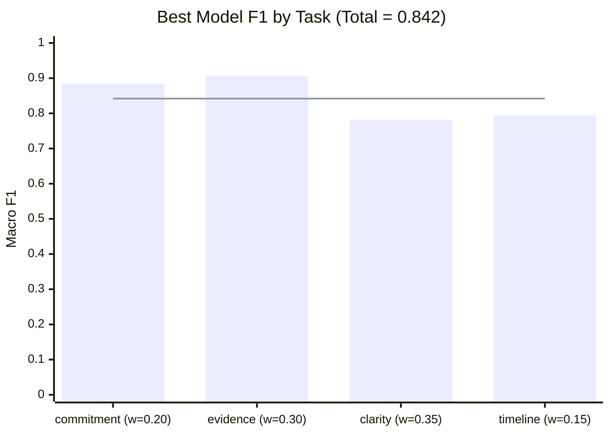
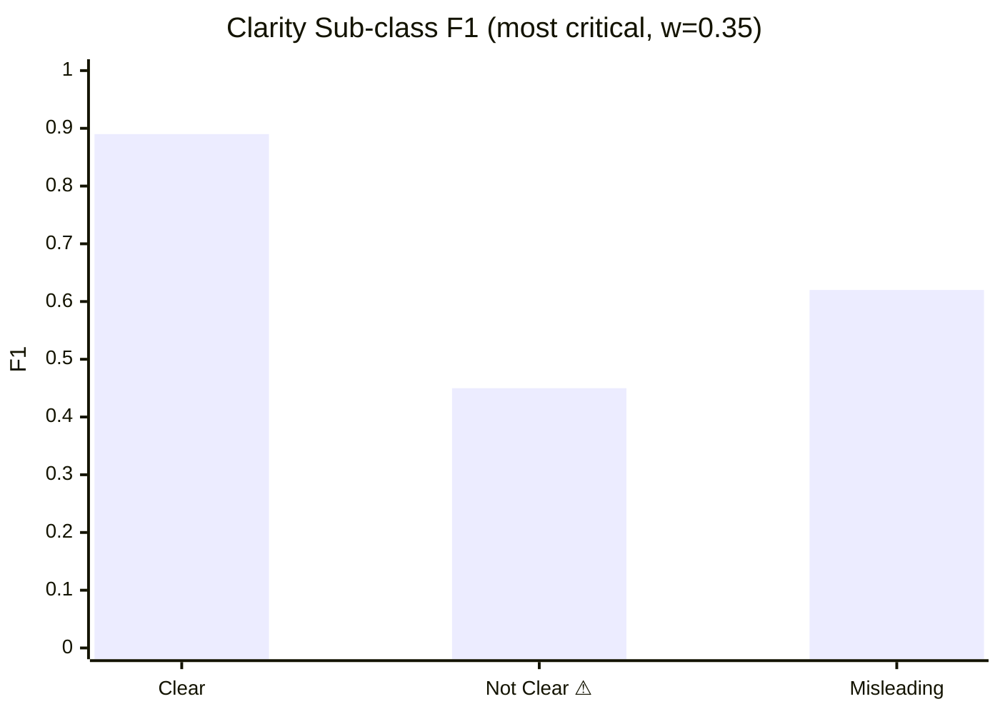

# ESG 競賽專案現況

## 競賽說明

- 任務：多標籤分類，給定一段 ESG 報告文字（`data` 欄位），預測 4 個子任務
- 訓練資料有 `promise_string` / `evidence_string`（標注者從 `data` 摘錄的句子），**測試資料沒有**
- 評分公式：`0.20×commitment + 0.15×timeline + 0.30×evidence + 0.35×clarity`

### 4 個子任務

| 任務 | 欄位 | 類別數 | 評分權重 |
|------|------|--------|---------|
| commitment | promise_status | 2 | 0.20 |
| timeline | verification_timeline | 4 | 0.15 |
| evidence | evidence_status | 2 | 0.30 |
| clarity | evidence_quality | 3 | 0.35 |

---

## 模型架構

```
raw data → BERT (hfl/chinese-macbert-base)
                │
         [CLS] hidden ──→ commitment head (2)
                      ──→ evidence head   (2)
                      ──→ clarity head    (3)
                      ──→ timeline head   (4)
                │
         每個 token ──→ promise_span_head  (start/end)  ← 訓練用，推論丟棄
                    ──→ evidence_span_head (start/end)  ← 訓練用，推論丟棄
                    ──→ keyword_head (binary 0/1)       ← 訓練用，推論丟棄
```

### 三層輔助任務邏輯

| 層級 | 任務 | 監督訊號來源 | 解決的問題 |
|------|------|------------|-----------|
| 句子段落級 | Span Extraction Aux | promise_string/evidence_string 的 token 位置 | 模型學會「關鍵句在哪裡」 |
| 詞語級 | Keyword Aux (filtered) | promise/evidence string 內有語意的詞 | 模型學會「哪些詞重要」 |

**filtered 的意思**：停用詞（的、了、在、於…）和標點不會被標為 keyword，保留有語意的詞和數字（如 2030）。

---

## 損失函數

```
Total Loss = 0.20×commitment + 0.35×evidence + 0.35×clarity + 0.10×timeline
           + 0.15×span_aux
           + 0.10×keyword_aux
```

> 注意：timeline 在損失裡是 0.10，但比賽評分是 0.15，這是刻意的設計選擇（之前討論過，先維持現狀）

---

## 訓練設定

- Pretrained: `hfl/chinese-macbert-base`
- MAX_SEQ_LEN: 256
- BATCH_SIZE: 16
- LEARNING_RATE: 1e-5
- EPOCHS: 23（Colab 跑）
- Early stopping: patience=5，以 **val_score（Macro F1）** 為準（不是 val_loss）
- Scheduler: OneCycleLR

---

## 資料

- 主資料：`data/raw/vpesg_4k_train_1000.json`（1000 筆）
- 增強資料（Google Drive symlink，放於 `esg_data/`）：

| 檔名 | 筆數 | 增強目標 | 內容說明 |
|------|------|---------|---------|
| `aug_timeline_within2.json` | 102 | timeline = within_2_years | 2025–2026 年承諾；原始資料只有 13 筆，嚴重不足 |
| `aug_timeline_between_clear.json` | 80 | timeline = between_2_5, Clear | 2027–2029 年承諾，有具體數字與明確執行進度 |
| `aug_timeline_between_mixed.json` | 80 | timeline = between_2_5, Not Clear/Misleading | 2027–2029 年承諾；Not Clear 26 筆 + Misleading 18 筆，補邊界樣本 |
| `aug_timeline_morethan.json` | 80 | timeline = more_than_5_years | 2030 年後長期目標 |
| `aug_commitment_no.json` | 100 | promise_status = No | 沒有做出承諾的 ESG 段落；原始資料 186 筆偏少 |
| `aug_evidence_no.json` | 100 | evidence_status = No | 有承諾但無佐證；timeline 四類均勻分布（各 25 筆）|
| `aug_quality_misleading.json` | 100 | evidence_quality = Misleading | 表面像承諾但實際誤導（舊版 timeline 全是 already 已修正）；timeline 四類各 25 筆 |
| `aug_quality_notclear.json` | 100 | evidence_quality = Not Clear | 承諾模糊無量化目標；timeline 分布對齊真實資料（between_2_5=45, already=28, more_than_5=27）|

增強資料由 AI 生成，merge 進原始資料後一起切分 train/val/test。

---

## 成績歷史

| 版本 | commitment | evidence | clarity | timeline | Total |
|------|-----------|---------|---------|---------|-------|
| Baseline | 0.64 | 0.72 | 0.73 | 0.38 | ~0.68 |
| + span aux | 0.837 | 0.865 | 0.746 | 0.478 | 0.759 |
| + val_score early stopping | 0.880 | 0.849 | 0.744 | 0.533 | 0.771 |
| + resume 接續訓練（現在最佳） | **0.884** | **0.906** | **0.782** | **0.794** | **0.842** |
| + keyword aux（退步，已停用） | 0.813 | 0.851 | 0.757 | 0.301 | 0.728 |

### 現在最佳成績視覺化（Total = 0.842）





---

## Colab 執行流程

```python
# 1. 掛載 Drive
from google.colab import drive
drive.mount('/content/drive')

# 2. Clone
import os; os.chdir('/content')
!rm -rf /content/translation-transformer
!git clone https://github.com/fylel/ESG-Sustainability-Commitment-Verification-Competition-2026.git /content/translation-transformer

# 3. 建 symlink（主資料 + 增強資料）
import os
dst_main = '/content/translation-transformer/data/raw/vpesg_4k_train_1000.json'
if not os.path.lexists(dst_main):
    os.symlink('/content/drive/MyDrive/esg_data/vpesg_4k_train_1000.json', dst_main)
for f in [
    'aug_timeline_within2.json',
    'aug_timeline_between_clear.json',
    'aug_timeline_between_mixed.json',
    'aug_timeline_morethan.json',
    'aug_commitment_no.json',
    'aug_evidence_no.json',
    'aug_quality_misleading.json',
    'aug_quality_notclear.json',
]:
    dst = f'/content/translation-transformer/data/raw/{f}'
    if not os.path.lexists(dst):
        os.symlink(f'/content/drive/MyDrive/esg_data/{f}', dst)

# 4. 安裝套件
!pip install transformers torch scikit-learn tensorboard tqdm matplotlib optuna -q

# 5a. 全新訓練（第一次 or 資料有大幅變動）
%cd /content/translation-transformer
!python train.py --data data/raw/vpesg_4k_train_1000.json \
  --augment data/raw/aug_timeline_within2.json \
            data/raw/aug_timeline_between_clear.json \
            data/raw/aug_timeline_between_mixed.json \
            data/raw/aug_timeline_morethan.json \
            data/raw/aug_commitment_no.json \
            data/raw/aug_evidence_no.json \
            data/raw/aug_quality_misleading.json \
            data/raw/aug_quality_notclear.json \
  --epochs 30

# 5b. 繼續訓練（從現有 checkpoint 接續，用較低 LR）
# 先把上次存的 .pt 複製到 /content/best.pt，再執行：
%cd /content/translation-transformer
!python train.py --data data/raw/vpesg_4k_train_1000.json \
  --augment data/raw/aug_timeline_within2.json \
            data/raw/aug_timeline_between_clear.json \
            data/raw/aug_timeline_between_mixed.json \
            data/raw/aug_timeline_morethan.json \
            data/raw/aug_commitment_no.json \
            data/raw/aug_evidence_no.json \
            data/raw/aug_quality_misleading.json \
            data/raw/aug_quality_notclear.json \
  --resume /content/best.pt \
  --lr 5e-6 \
  --epochs 15

# 6. 評估
!python evaluate.py --data data/raw/vpesg_4k_train_1000.json \
  --checkpoint /content/best.pt \
  --augment data/raw/aug_timeline_within2.json \
            data/raw/aug_timeline_between_clear.json \
            data/raw/aug_timeline_between_mixed.json \
            data/raw/aug_timeline_morethan.json \
            data/raw/aug_commitment_no.json \
            data/raw/aug_evidence_no.json \
            data/raw/aug_quality_misleading.json \
            data/raw/aug_quality_notclear.json

# 7. 存模型 + 圖表
from datetime import datetime; import shutil
ts = datetime.now().strftime("%m%d_%H%M")
shutil.copy('/content/best.pt',
            f'/content/drive/MyDrive/esg_data/best_{ts}.pt')
shutil.copy('/content/translation-transformer/f1_scores.png',
            f'/content/drive/MyDrive/esg_data/f1_scores_{ts}.png')
```

---

## 資料分布：增強前 vs 增強後

總樣本數：原始 1,000 筆 → 增強後 **1,742 筆**（+742）

### verification_timeline

| 類別 | 原始 | 原始 % | 增強後 | 增強後 % | 變化 |
|------|-----:|-------:|-------:|---------:|------|
| already | 366 | 36.6% | 445 | 25.5% | ↓（相對比例下降，絕對數增加）|
| between_2_and_5_years | 238 | 23.8% | 492 | 28.2% | ↑ |
| more_than_5_years | 197 | 19.7% | 353 | 20.3% | ≈ |
| within_2_years | **13** | **1.3%** | **166** | **9.5%** | ↑↑ 大幅補足 |
| 空值/N/A | 186 | 18.6% | 286 | 16.4% | ≈ |

### evidence_quality

| 類別 | 原始 | 原始 % | 增強後 | 增強後 % | 變化 |
|------|-----:|-------:|-------:|---------:|------|
| Clear | 552 | 55.2% | 743 | 42.7% | ↓（稀釋）|
| Not Clear | 124 | 12.4% | 261 | 15.0% | ↑ |
| Misleading | **1** | **0.1%** | **119** | **6.8%** | ↑↑ 大幅補足 |
| 空值/N/A | 323 | 32.3% | 619 | 35.5% | ≈ |

### promise_status / evidence_status

| 欄位 | 類別 | 原始 | 增強後 |
|------|------|-----:|-------:|
| promise_status | No | 186 (18.6%) | 286 (16.4%) |
| promise_status | Yes | 814 (81.4%) | 1456 (83.6%) |
| evidence_status | No | 137 (13.7%) | 333 (19.1%) ↑ |
| evidence_status | Yes | 677 (67.7%) | 1123 (64.5%) |

---

## 當前弱點分析（基於 0.842 成績）

| 弱點 | 影響程度 | 說明 | 處理狀態 |
|------|---------|------|---------|
| Clarity「Not Clear」F1=0.45 | 最高（權重 0.35） | 和 Clear 邊界模糊 | ✅ 已補 aug_quality_notclear.json（100 筆）|
| Timeline「between_2_and_5_years」F1=0.63 | 中 | recall=0.55 | ✅ 已補 aug_timeline_between_mixed.json（80 筆 Not Clear/Misleading）|
| Misleading 舊資料 timeline 全是 already | 高 | 假關聯 | ✅ 已替換 aug_quality_misleading.json（timeline 均勻）|
| within_2_years F1=1.00（虛假） | 中 | 競賽真實資料可能崩 | 待觀察 |
| Commitment「No」F1=0.81 | 低 | 類別不平衡 | 已有 aug_commitment_no.json |

## 已知問題 / 待處理

- keyword aux 實作完成但會造成退步（timeline 從 0.533 跌到 0.301），原因待查，目前停用（USE_KEYWORD_AUX = False）
- 下次方向：
  1. 上傳新增強資料到 Google Drive，重新訓練（--epochs 30）
  2. 若 clarity Not Clear 仍弱，考慮調高 clarity 的 TASK_LOSS_WEIGHTS（0.35 → 0.40）
  3. 調低 KEYWORD_LOSS_WEIGHT（0.10 → 0.05）重試 keyword aux
